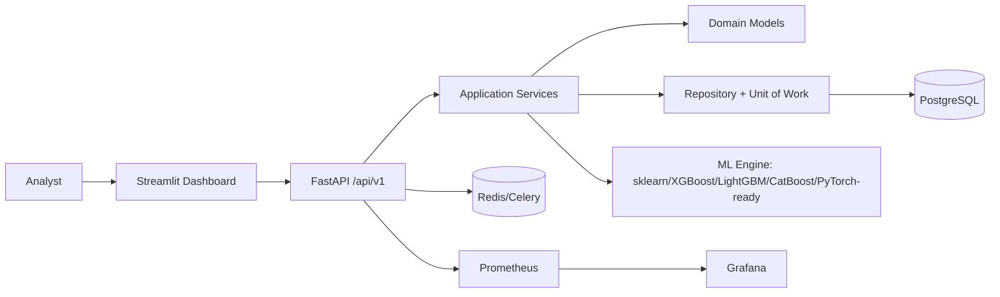

# SovereignAI

Indigenous AI-powered cyber threat detection platform for India's critical infrastructure. SovereignAI provides a FastAPI control plane, Streamlit SOC dashboard, repository/service-layer domain modules, and a local ML pipeline that avoids proprietary cloud AI dependencies.

## Architecture Diagram


## Folder Structure
- `src/sovereignai/api` versioned REST API and middleware.
- `src/sovereignai/users`, `authentication`, `authorization`, `organizations`, `projects` bounded contexts.
- `src/sovereignai/threat_detection`, `ml_engine`, `feature_engineering`, `deep_learning`, `anomaly_detection` AI modules.
- `data/samples` synthetic, non-malicious cyber datasets.
- `docs`, `configs`, `scripts`, `tests` enterprise support assets.

## Installation
```bash
python3.13 -m venv .venv
source .venv/bin/activate
pip install -e .[dev]
```

## Docker Setup
```bash
docker compose up --build
```
API: http://localhost:8000/docs. Dashboard: http://localhost:8501.

## Running Locally
```bash
uvicorn sovereignai.api.main:app --reload
streamlit run src/sovereignai/dashboard/app.py
```

## Running Tests
```bash
pytest
ruff check .
bandit -r src
```

## Training Models
```bash
python scripts/train_model.py
```

## Inference
POST `/api/v1/threats/predict` with normalized network telemetry to receive `threat_class`, `risk_score`, `confidence`, and explainability reasons.

## Deployment
Use Docker Compose for development and adapt `configs/nginx`, `configs/prometheus`, and environment variables for production Kubernetes or VM deployments.

## Screenshots Placeholders
- `docs/screenshots/dashboard-overview.png`
- `docs/screenshots/threat-feed.png`
- `docs/screenshots/model-metrics.png`

## Roadmap
- Hardware-rooted secret management integration.
- ONNX model export and signed model registry promotion.
- SIEM connectors and STIX/TAXII feeds.
- Advanced SHAP/LIME reports for each model family.

## Contributors
See `CODEOWNERS` and `CONTRIBUTING.md`.

## License
Apache-2.0. See `LICENSE`.
