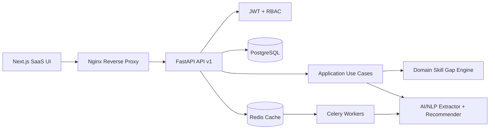

# SkillGap AI — AI-Powered Skill Gap Identifier Tool

SkillGap AI is a production-style full-stack SaaS platform that compares a learner's current capabilities against target role requirements, real-time industry demand, and learning history. It extracts skills from resumes and job descriptions, calculates match percentages and confidence scores, ranks missing skills, and generates personalized learning roadmaps.

> Frontend uses Next.js 16.2.5 (latest stable verified on May 11, 2026), TypeScript, Tailwind CSS, ShadCN-inspired primitives, Zustand, TanStack Query, Framer Motion-ready components, Recharts, and dark/light mode. Backend uses FastAPI, Pydantic, SQLAlchemy, PostgreSQL, Alembic, Redis, Celery, Sentence Transformers-ready AI interfaces, Scikit-learn-ready ranking, LangChain/OpenAI-compatible configuration, JWT auth, RBAC, rate limiting, and structured logging.

## Architecture



## Core Capabilities

- JWT registration/login, secure password hashing, role-based admin/org/user access.
- Resume upload endpoint with parser abstraction for PDF/DOCX/text extraction.
- Job description analyzer that classifies mandatory, optional, and advanced skills.
- Pure domain skill-gap engine with match percentage, missing skills, priorities, proficiency estimates, and confidence scoring.
- AI recommendation engine that generates ranked courses, certifications, projects, practice plans, milestones, and estimated timelines.
- SaaS dashboard, upload screens, analytics cards, radar charts, sidebar navigation, responsive layout, dark/light theme, loading skeletons, and error boundary.
- PostgreSQL normalized schema with users, resumes, skills, job descriptions, assessments, recommendations, learning paths, analytics, constraints, and indexes.
- Docker Compose stack with API, web, PostgreSQL, Redis, Celery worker, and Nginx.
- GitHub Actions CI for backend tests, frontend tests/build, and Docker validation.

## Folder Structure

```text
apps/api/        Clean Architecture FastAPI backend
apps/web/        Next.js SaaS frontend
infra/nginx/     Reverse proxy configuration
docs/            Architecture and API documentation
.github/         CI/CD workflows
```

## Quick Start

```bash
cp .env.example .env
docker compose up --build
```

- Web: http://localhost:3000
- API health: http://localhost:8000/health
- Swagger: http://localhost:8000/api/docs
- Nginx gateway: http://localhost:8080

## Local Development

```bash
cd apps/api && pip install -e '.[dev]' && uvicorn app.main:app --reload
cd apps/web && npm install && npm run dev
```

## API Overview

| Area | Method | Endpoint | Purpose |
| --- | --- | --- | --- |
| Auth | POST | `/api/v1/auth/register` | Create user and issue JWT |
| Auth | POST | `/api/v1/auth/login` | Authenticate user |
| Resume | POST | `/api/v1/resumes/analyze` | Upload and extract profile |
| Jobs | POST | `/api/v1/jobs/analyze` | Analyze JD required skills |
| Assessments | POST | `/api/v1/assessments/skill-gap` | Calculate skill gap |
| Recommendations | POST | `/api/v1/recommendations/learning-path` | Generate roadmap |
| Analytics | GET | `/api/v1/analytics/dashboard` | Admin metrics |
| Trends | GET | `/api/v1/analytics/industry-trends` | Market trends |

## Screenshots

Add portfolio screenshots under `docs/screenshots/` after launching the app:

- `dashboard.png`
- `resume-upload.png`
- `recommendations.png`
- `admin-analytics.png`

## Deployment Notes

1. Set strong `JWT_SECRET_KEY`, production `DATABASE_URL`, `REDIS_URL`, and CORS origins.
2. Disable `AI_MOCK_MODE` when OpenAI-compatible credentials are configured.
3. Run `alembic upgrade head` before starting API workers.
4. Terminate TLS at your cloud load balancer or extend `infra/nginx/nginx.conf` with certificates.
5. Configure scheduled Celery jobs for market trend refresh and embedding re-indexing.

## Quality Gates

- Backend: `pytest`, `ruff`, `mypy`.
- Frontend: `npm run lint`, `npm test`, `npm run build`.
- Containers: `docker compose config` and image builds.
