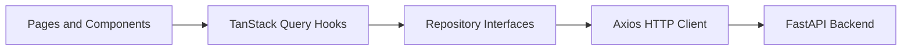

# ClimateShield AI Dashboard

React 19 + TypeScript + Vite dashboard for the ClimateShield AI FastAPI recommendation backend.

## Architecture



## Folder Structure

- `src/components`: reusable UI, charts, map, forms, layout, recommendation presentation.
- `src/pages`: route-level pages.
- `src/hooks`: query and mutation orchestration.
- `src/repositories`: API repository pattern adapters.
- `src/services`: shared HTTP client.
- `src/types`: API contracts.
- `src/theme`: MUI theme factory.

## Installation

```bash
cp .env.example .env
npm install
npm run dev
```

The dashboard runs on `http://localhost:3000` and expects the backend at `VITE_API_BASE_URL`.

## Testing and Quality

```bash
npm run lint
npm run test
npm run build
```

## Docker

```bash
docker compose up --build
```

## Developer Guide

Do not call Axios directly from React components. Add new API calls through repository interfaces and consume them from hooks.
