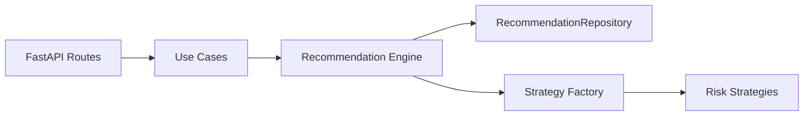
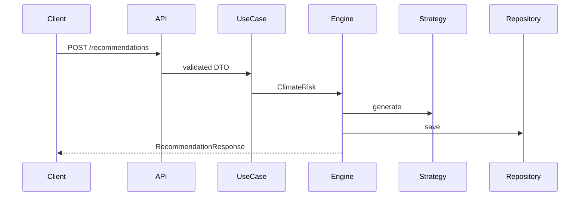

# Architecture

```mermaid
flowchart LR
API[FastAPI Routes] --> UC[Use Cases]
UC --> Engine[Recommendation Engine]
Engine --> Repo[RecommendationRepository]
Engine --> Factory[Strategy Factory]
Factory --> Strategies[Risk Strategies]
```

```mermaid
sequenceDiagram
Client->>API: POST /recommendations
API->>UseCase: validated DTO
UseCase->>Engine: ClimateRisk
Engine->>Strategy: generate
Engine->>Repository: save
Engine-->>Client: RecommendationResponse
```
