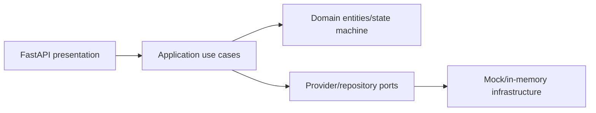

# Architecture

Controllers validate DTOs and delegate only. `LifeEventService` coordinates event reporting, planning, confirmation, and mock submission; `WorkflowPlanner` is an event-type strategy registry. Domain task transitions are explicit.
