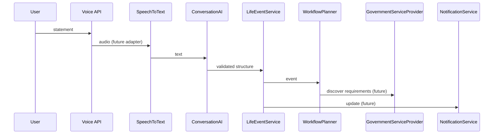
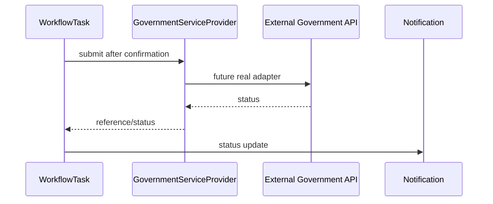

# Sequences

```mermaid
sequenceDiagram
 User->>Voice API: statement
 Voice API->>SpeechToText: audio (future adapter)
 SpeechToText->>ConversationAI: text
 ConversationAI->>LifeEventService: validated structure
 LifeEventService->>WorkflowPlanner: event
 WorkflowPlanner->>GovernmentServiceProvider: discover requirements (future)
 LifeEventService->>NotificationService: update (future)
```

```mermaid
sequenceDiagram
 WorkflowTask->>GovernmentServiceProvider: submit after confirmation
 GovernmentServiceProvider->>External Government API: future real adapter
 External Government API-->>GovernmentServiceProvider: status
 GovernmentServiceProvider-->>WorkflowTask: reference/status
 WorkflowTask->>Notification: status update
```
