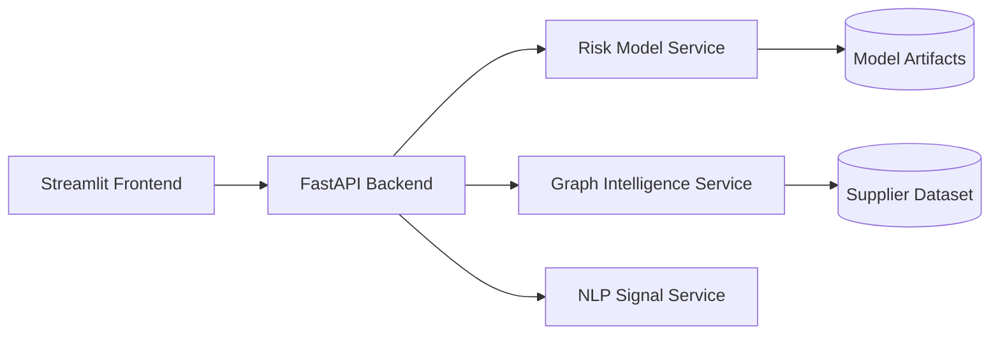

# Architecture

```mermaid
flowchart LR
  UI[Streamlit Frontend] --> API[FastAPI Backend]
  API --> ML[Risk Model Service]
  API --> G[Graph Intelligence Service]
  API --> NLP[NLP Signal Service]
  ML --> M[(Model Artifacts)]
  G --> D[(Supplier Dataset)]
```
